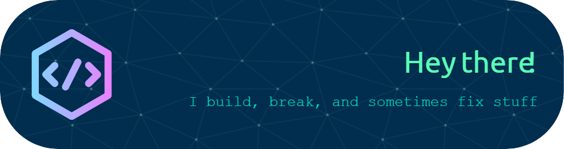

# I'm Raman
*Developer / Problem Creator and Solver*

I am a Full Stack developer, problem solving enthusiast with various expertise in Python, React, Express, Node and many more.

- **Lifelong Learner** 📚 | Always exploring new tech horizons
- **Problem-Solver** 🧩 | Turning challenges into opportunities
- **Curious Tinkerer** 🛠️ | Experimenting with new ideas and projects
- **Student of Life** 🙂 | Growing with every line of code

---

<h2 align="center">Tech Stack</h2>

    
    
    
    
    
    
    
    
    

---

<h2 align="center">Github Stats</h2>
<table width="100%">
    <tr>
        <td rowspan=3>
        <h3 align="center"><strong>LANGUAGES</strong></h3>
        

            
        

        </td>
    </tr>
    <tr>
        <td width="40%">
        <h3 align="center"><strong>GITHUB STATS</strong></h3>
        

            
        

        </td>
    </tr>
    <tr>
        <td width="50%">
        <h3 align="center"><strong>STREAK STATS</strong></h3>
        

            
        

        </td>
    </tr>
    <tr>
        <td colspan=2>
        <h3 align="center"><strong>CONTRIBUTION GRAPH</strong></h3>
        

            
        

        </td>
    </tr>
</table>

<h2 align="center">Connect with me</h2>

    
    
    
    

---